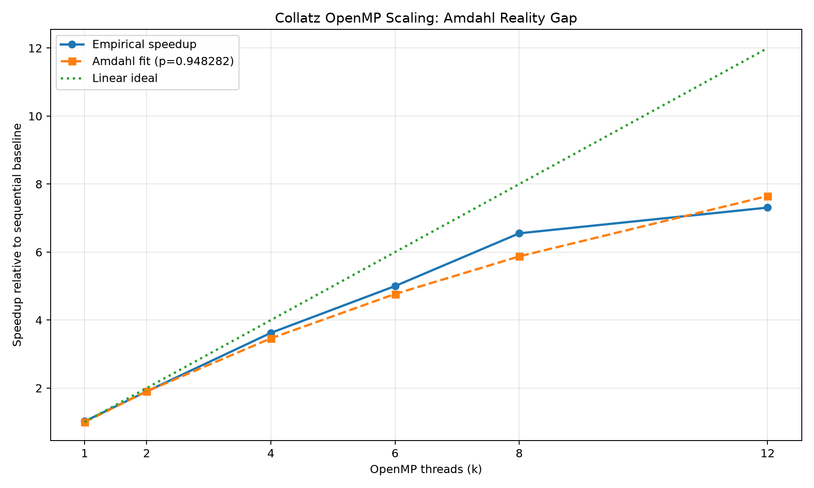

# CSS314 Laboratory — The Amdahl Reality Gap

- **Student:** Ayazgaliyev Aibek
- **Student ID:** 230103341
- **Group:** 06-P, 02-N
- **Practicum Date & Time (Slot):** 24.09.2026, 12:20 local time (UTC+05:00)

## Workload

The Student ID workload formula gives:

```text
N = 10,000,000 + (341 × 1,000) = 10,341,000
```

For every integer in `[1, N]`, the benchmark computes the Collatz stopping time, the maximum stopping time, the number of values requiring more than 100 steps, and a checksum modulo `1,000,000,007`.

## Benchmark machine

- Lenovo 82Y9
- Windows 11 Pro 64-bit
- AMD Ryzen 5 7640HS
- 6 physical cores / 12 logical processors
- 64-byte L1 data-cache line
- MinGW GCC 6.3.0 with OpenMP

Complete hardware output is in [`src/hw_info.txt`](src/hw_info.txt).

## Project layout

```text
src/
├── collatz.c                 # C/OpenMP benchmark implementation
├── analyze_results.py        # CSV aggregation, Amdahl fitting, and plot generation
├── cache_line_probe.c        # CPUID cache-line verification utility
├── hw_info.txt               # Hardware and benchmark environment
├── results.csv               # Merged raw benchmark dataset
├── results_summary.csv       # Computed averages, speedups, gaps, and throughput
├── analysis_summary.txt      # Text summary of measured results
├── speedup_plot.png          # Empirical, Amdahl, and ideal speedup plot
├── raw/                      # Per-phase raw CSV files
└── logs/                     # Console logs from benchmark execution
```

`src/Main.kt` is an earlier unrelated Kotlin exercise and is not used by this laboratory.

## Build and run

From the repository root:

```powershell
gcc -O2 -fopenmp -std=c11 -Wall -Wextra -Wpedantic src/collatz.c -o src/collatz.exe
```

Run from `src` so generated CSV files remain with the source:

```powershell
cd src
.\collatz.exe all
python analyze_results.py
```

Run 1 of every configuration is a warmup. The analysis script averages Runs 2 and 3.

## Verified correctness results

All 42 benchmark runs produced the same logical output:

| Item | Result |
|---|---:|
| Checksum | 608,547,103 |
| Maximum stopping time | 685 steps |
| Values requiring more than 100 steps | 8,197,974 |

## Phase 2 — Sequential baseline

Benchmarks used `omp_get_wtime()`, `OMP_DYNAMIC=FALSE`, and `OMP_PROC_BIND=TRUE`. Run 1 was treated as the cold/warmup run and excluded from every average.

| Sequential run | Time |
|---:|---:|
| Run 1, cold | 4.079 s |
| Run 2 | 4.157 s |
| Run 3 | 4.138 s |
| **`T_seq` average of Runs 2–3** | **4.147500 s** |

## Phase 3 — OpenMP scaling and Amdahl fitting

The CPU supports 12 normal OpenMP threads, so the worksheet's “16 if supported” case was replaced by 12 threads. A supplemental 6-thread run was added because this CPU has exactly 6 physical cores.

Two-thread calculation:

```text
S_emp(2) = T_seq / T_2 = 4.147500 / 2.181000 = 1.901651
p = 2 × (1 − 1/S_emp(2)) = 0.948282
```

`Delta` means `S_theo − S_emp`. A negative delta means the measured run was faster than the fitted Amdahl curve.

| Threads | Run 1 cold | Run 2 | Run 3 | Average | `S_emp` | `S_theo` | Delta |
|---:|---:|---:|---:|---:|---:|---:|---:|
| 1 | 4.157 | 4.186 | 3.932 | **4.059000 s** | **1.0218×** | 1.0000× | −0.0218 |
| 2 | 1.953 | 2.199 | 2.163 | **2.181000 s** | **1.9017×** | 1.9017× | 0.0000 |
| 4 | 1.185 | 1.137 | 1.152 | **1.144500 s** | **3.6239×** | 3.4627× | −0.1611 |
| 6 physical | 0.810 | 0.826 | 0.833 | **0.829500 s** | **5.0000×** | 4.7672× | −0.2328 |
| 8 | 0.631 | 0.633 | 0.633 | **0.633000 s** | **6.5521×** | 5.8736× | −0.6785 |
| 12 logical | 0.545 | 0.529 | 0.606 | **0.567500 s** | **7.3084×** | 7.6487× | +0.3403 |

At 6 physical threads the program achieved 5.00× speedup. At 12 logical threads it achieved 7.31×, so SMT increased performance by another 1.46× relative to the physical-core result, but did not double it.

## Phase 4A — False-sharing experiment

Both variants used 6 physical threads and counted the same 8,197,974 values whose stopping times exceeded 100.

| Variant | Run 1 cold | Run 2 | Run 3 | Average | Throughput |
|---|---:|---:|---:|---:|---:|
| Naive adjacent counters | 0.865 | 0.796 | 0.792 | **0.794000 s** | **13,023,930 iter/s** |
| 64-byte padded counters | 0.815 | 0.808 | 0.807 | **0.807500 s** | **12,806,191 iter/s** |

```text
Naive/padded time ratio = 0.794000 / 0.807500 = 0.983282
Padded/naive time ratio = 1.017016
```

**Observed result:** no false-sharing penalty appeared in this particular measurement. The naive version was approximately 1.7% faster than the padded version. The conditional counter updates were not frequent enough, relative to the Collatz arithmetic, to dominate runtime on this Ryzen CPU. This is an honest negative result rather than a fabricated expected result.

## Phase 4B — OpenMP scheduling experiment

All scheduling variants used 12 threads.

| Schedule | Chunk | Run 1 cold | Run 2 | Run 3 | Average | Throughput | Speedup vs sequential |
|---|---:|---:|---:|---:|---:|---:|---:|
| `static` | default | 0.548 | 0.548 | 0.590 | **0.569000 s** | 18,173,988 iter/s | 7.2891× |
| `static` | 1,000 | 0.513 | 0.543 | 0.536 | **0.539500 s** | 19,167,745 iter/s | 7.6877× |
| `dynamic` | 100 | 0.493 | 0.480 | 0.504 | **0.492000 s** | **21,018,291 iter/s** | **8.4299×** |
| `dynamic` | 10,000 | 0.538 | 0.521 | 0.569 | **0.545000 s** | 18,974,311 iter/s | 7.6101× |
| `guided` | adaptive | 0.607 | 0.621 | 0.785 | **0.703000 s** | 14,709,816 iter/s | 5.8997× |

**Observed result:** `schedule(dynamic, 100)` was fastest. It was 13.5% faster than default static scheduling and 9.7% faster than `dynamic(10000)`. Fine-grained queue overhead did not outweigh load-balancing benefits at chunk size 100. Guided scheduling was the slowest variant.

## Phase 5 — Technical analysis

### Q1. Micro-architectural root cause of false sharing

The CPUID probe verified a 64-byte L1 data-cache line. In the naive variant, six adjacent 4-byte counters can occupy the same cache line. When different cores increment those counters, MESI/MOESI coherence invalidates or transfers ownership of the whole line, even though the threads write different integers. This can create cache-to-cache transfer and invalidation traffic.

In this execution, however, that mechanism did not dominate runtime. The padded counters were 1.7% slower, so the expected penalty was smaller than normal run-to-run and code-layout effects. Padding remains the correct mitigation, but this workload's conditional increments were too infrequent to expose a large penalty.

### Q2. Hyperthreading saturation and physical-core ceiling

Scaling continued after 6 physical cores, but not linearly:

- 6 physical threads: 5.0000×
- 12 logical threads: 7.3084×
- Relative SMT gain: 1.46× over the 6-thread result

The thread count doubled from 6 to 12, but speedup did not double because SMT siblings share the front end, execution ports, ALUs, load/store queues, L1/L2 bandwidth, and other physical pipeline resources.

### Q3. Empirical versus theoretical Amdahl discrepancy

The fitted parallel fraction was `p = 0.948282`. The empirical curve exceeded the fitted curve at 4, 6, and 8 threads, then fell below it at 12 threads. Two physical effects omitted by the simple Amdahl equation are:

1. **SMT resource contention:** logical threads share execution resources, so 12 threads cannot behave like 12 independent cores.
2. **Runtime and machine-state overhead:** thread creation, reductions, barriers, OS scheduling, frequency changes, and cache behavior are not represented by a single fixed serial fraction.

The value of `p` was fitted from one noisy two-thread measurement, so it should not be interpreted as an exact architectural constant.

### Q4. Scheduling trade-off

For this irregular Collatz workload, `dynamic(100)` provided the best balance. It distributed expensive trajectories more evenly than static scheduling and outperformed `dynamic(10000)`. Lock-queue contention did **not** outweigh load-balancing benefits at either tested dynamic chunk size; the fastest measured result was at the smaller chunk size, 100. Guided scheduling had the worst average runtime.

## Generated artifacts

- [`src/results.csv`](src/results.csv) — merged raw dataset
- [`src/results_summary.csv`](src/results_summary.csv) — calculated metrics
- [`src/analysis_summary.txt`](src/analysis_summary.txt) — plain-text summary
- [`src/hw_info.txt`](src/hw_info.txt) — hardware dump
- [`src/raw/`](src/raw/) — per-phase raw CSV files
- [`src/logs/`](src/logs/) — execution logs


