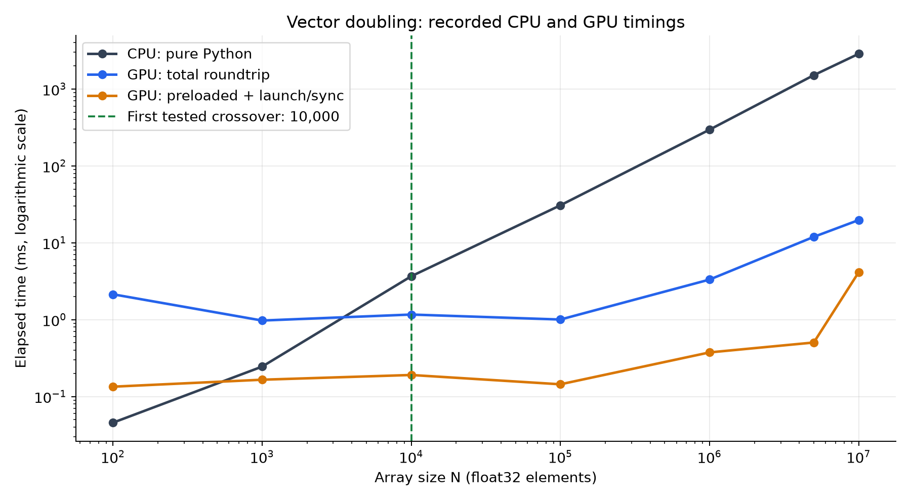
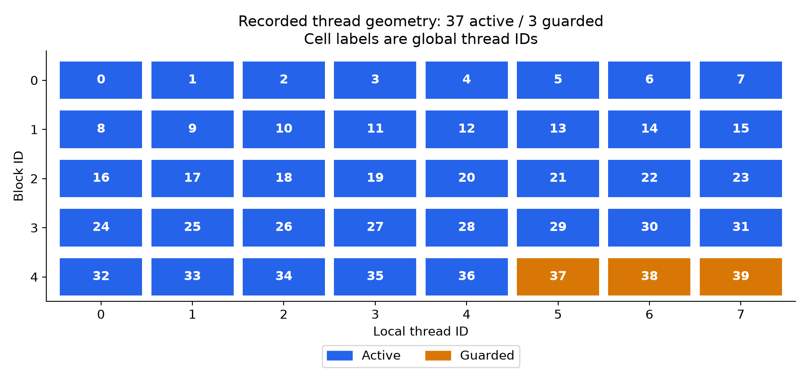
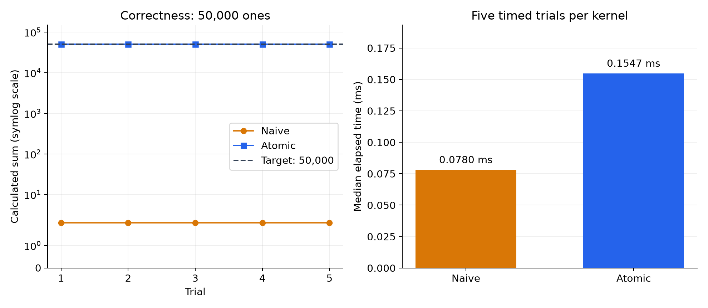
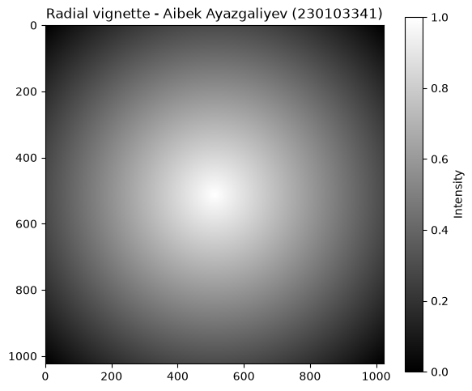

# CUDA Lecture: 08.10.2026, 11:30

**Aibek Ayazgaliyev | 230103341**

The six experimental sections have been executed on the physical **NVIDIA GeForce RTX 4060 Laptop GPU**, using the local GPU as requested instead of the PDF's Colab T4. The notebook retains the actual outputs and the vignette image.

## Deliverables

- [CUDA_Lab01_230103341.ipynb](CUDA_Lab01_230103341.ipynb): executed notebook, including hardware telemetry and verification token.
- [TASK_SHEET.md](TASK_SHEET.md): filled experimental tables, analysis answers, boundary observation, geometry, and token.
- [CUDA_Benchmark_230103341.csv](CUDA_Benchmark_230103341.csv): all seven measured benchmark rows.
- [CUDA_Results_230103341.json](CUDA_Results_230103341.json): full-precision results and captured console output.

## Method

The notebook follows the PDF's pure Python CPU loop and synchronized `time.perf_counter()` GPU timings. CPU measurements include all seven sizes rather than using the permitted skip. The input seed is `230103341`.

The deliberately unguarded kernel runs in a separate process on the same GPU so an illegal memory access cannot invalidate the later experiments' CUDA context. Its actual console output is retained. The reduction uses 50,000 ones and resets the accumulator before every trial. The complete 1024 x 1024 GPU vignette is checked against a NumPy reference.

Driver-supported CUDA is 13.3; the installed CUDA compilation/runtime packages are from CUDA 12.9. These version fields describe different components.

## Hardware

| Property | Measured value |
|---|---|
| GPU | NVIDIA GeForce RTX 4060 Laptop GPU |
| NVIDIA driver | 610.88 |
| Driver-supported CUDA | 13.3 |
| Total VRAM | 8188 MiB |
| Compute capability | 8.9 |
| Multiprocessors | 24 |
| Maximum threads per block | 1024 |
| Warp size | 32 |

## Vector Doubling and Crossover

| Array size | CPU (ms) | GPU total (ms) | GPU preloaded (ms) | Winner |
|---:|---:|---:|---:|---|
| 100 | 0.0457 | 2.1380 | 0.1343 | CPU |
| 1,000 | 0.2450 | 0.9740 | 0.1655 | CPU |
| 10,000 | 3.6681 | 1.1655 | 0.1907 | GPU |
| 100,000 | 30.7190 | 1.0040 | 0.1443 | GPU |
| 1,000,000 | 295.8954 | 3.3209 | 0.3750 | GPU |
| 5,000,000 | 1513.1914 | 11.9360 | 0.5044 | GPU |
| 10,000,000 | 2868.9268 | 19.7433 | 4.1378 | GPU |



The first tested crossover is **N = 10,000**. At N = 100, the difference between GPU total and preloaded time is **93.72%** of the roundtrip time. Allocation and PCIe transfers dominate this small workload; the measured difference does not isolate PCIe alone. Following the PDF's stopwatch method, the preloaded measurement also includes host launch and synchronization overhead.

## Thread Geometry and Boundary Guard

For N = 1,000 with 256 threads per block, 4 blocks launch 1,024 threads. Without a boundary guard, **24 threads write outside the array**. The actual defective run returned exit code 0 and printed `Elements processed: 1000. Last element: 999.0`; no illegal-address error was reported. This does not prove the writes were safe.

For N = 37 with 8 threads per block, the GPU inspector verified **5 blocks, 40 launched threads, 37 active threads, and 3 guarded threads**. The diagram below is derived from that recorded geometry, not a GPU screenshot.



## Race Condition and Atomic Reduction

| Trial | Target | Naive result | Lost updates |
|---:|---:|---:|---:|
| 1 | 50,000 | 2 | 49,998 |
| 2 | 50,000 | 2 | 49,998 |
| 3 | 50,000 | 2 | 49,998 |
| 4 | 50,000 | 2 | 49,998 |
| 5 | 50,000 | 2 | 49,998 |



The atomic kernel returned exactly **50,000.0** in every trial. Median measured times were **0.0780 ms naive** and **0.1547 ms atomic**, a **1.98x** ratio. Atomic updates prevent lost writes but serialize contention at the shared scalar. Identical naive results across five trials do not make that algorithm correct.

## 2D Radial Vignette

The 1024 x 1024 canvas uses 16 x 16 threads per block and a **64 x 64 grid (4096 blocks)**. The measured center pixel is **1.0** and the corner pixel is **0.0**. The full GPU output passed comparison with the NumPy reference.



This PNG is extracted directly from the executed notebook's retained image output; it is not a newly computed CPU approximation.

## Verification

Student-seeded verification token: **`DF248880DE203CB7`**.

All eight code cells executed sequentially without notebook errors. The CSV agrees with the full-precision JSON, and a separate physical-GPU recomputation reproduced the checksum. Full observations and analysis are in [TASK_SHEET.md](TASK_SHEET.md).

## Reproduce

Use Python 3.12 and an NVIDIA GPU with a compatible driver. From this folder:

```powershell
python -m pip install -r requirements.txt
python run_notebook.py
python make_plots.py
```

`run_notebook.py` executes the notebook with the same Python interpreter and regenerates its outputs and result files. Timings and race-condition outputs can change between runs. Dependencies were installed in an isolated environment, not the project's existing Python installation. NumPy is pinned to 2.2.6 because the installed numba-cuda compiler references `np.row_stack`, which is absent from NumPy 2.5.

The local execution does not fulfill the PDF's specific Colab T4 provisioning requirement. Google Drive saving and course-portal submission have not been performed.

To regenerate only the report images without rerunning CUDA, run `python make_plots.py`. It reads the stored JSON measurements and exports the existing notebook image. The plotting script does not change the recorded timings or checksum.
