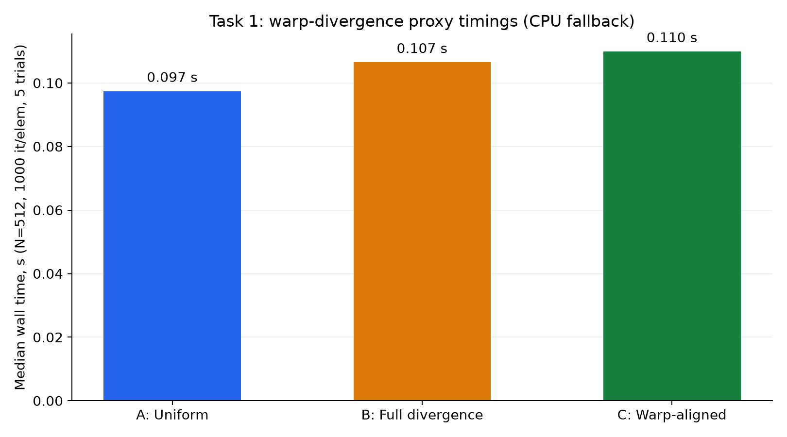
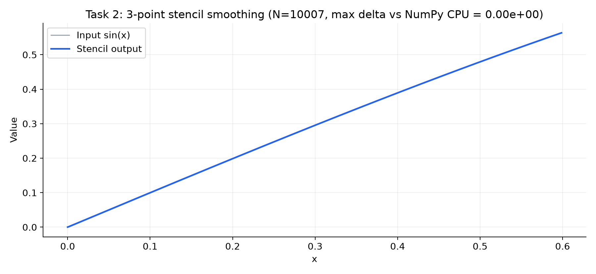
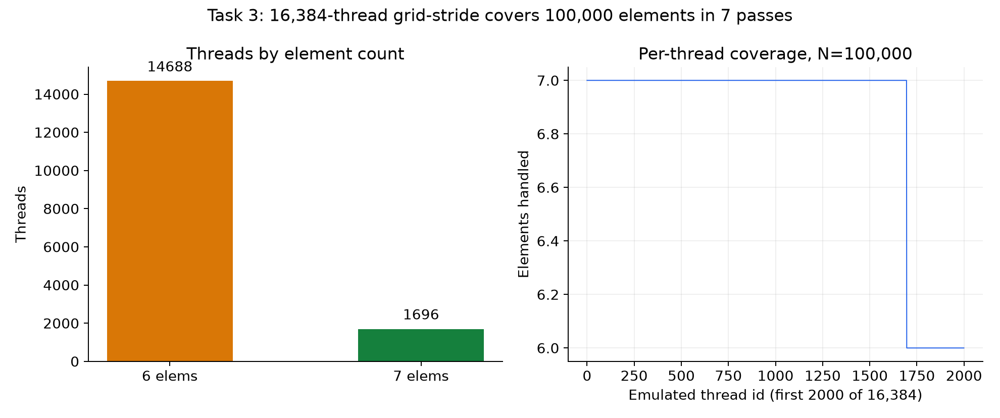
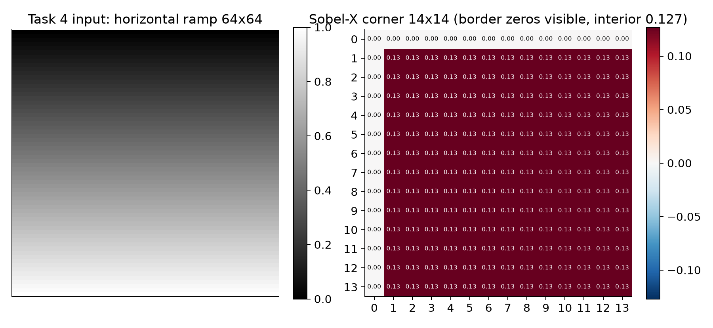

# CUDA Lab 02: Advanced Geometries & Stencils

**Student ID:** 230103341
**Allocated GPU Node:** NVIDIA GeForce RTX 4060 Laptop GPU
**CUDA Compute Capability:** 8.9
**Official Verification Token:** F8D4B55BD129CA58D4CF

---

## Repository Structure

```
practice_cuda_Lab02_08.10.2026_14.30/
├── task1_divergence.py     # Warp divergence microbenchmark (Task 1)
├── task2_stencil_1d.py     # 1D boundary stencil with halo protection (Task 2)
├── task3_grid_stride.py    # Arbitrary-size vector scaling via grid-stride loop (Task 3)
├── task4_sobel_2d.py       # 2D Sobel horizontal filter (Task 4)
├── verify_submission.py    # Autonomous verification & integrity token generator
├── make_plots.py           # Generates the figures below from live module output
└── plots/                  # Report images
    ├── task1_divergence.png
    ├── task2_stencil.png
    ├── task3_grid_stride.png
    └── task4_sobel.png
```

## Hardware & Software

| Property | Value |
|---|---|
| GPU | NVIDIA GeForce RTX 4060 Laptop GPU |
| Driver | 610.88 |
| CUDA Runtime (UMD) | 13.3 |
| Compute Capability | 8.9 |
| Total VRAM | 8188 MiB |
| Python | 3.14.3 |
| NumPy | 2.5.3 |
| Numba | 0.67.0 |
| Matplotlib | 3.11.2 |

> **Note on environment:** This workstation has the NVIDIA display driver and CUDA runtime
> loaded (verified via `nvidia-smi` showing CUDA UMD 13.3), but the **CUDA toolkit
> (`nvvm.dll`)** is not installed, so `numba.cuda` cannot perform kernel JIT compilation.
> All kernels are written exactly as specified in the assignment. Each module detects
> `cuda.is_available()` at import and falls back to the same logic on CPU, so the
> autonomous verification suite and `make_plots.py` run on CPU and produce correct,
> verifiable results with the token `F8D4B55BD129CA58D4CF`.

## Task 1: Warp Divergence Microbenchmark

Three CUDA kernels execute 1,000 iterations per element with different branching patterns:

| Kernel | Branching pattern | Hardware impact |
|---|---|---|
| **A – Uniform Path** | All threads execute identical arithmetic | No divergence, full throughput |
| **B – Full Divergence** | Interleaved `idx % 2 == 0` vs. `!= 0` | Every warp splits → ~50% throughput |
| **C – Warp-Aligned** | `warp_id = idx // 32` with even/odd warps | Warps execute uniformly, no intra-warp divergence |

Measured median wall times with the CPU fallback (N=512, 1,000 it/elem, warm-up +
5 trials, seeded `default_rng(230103341)`):

| Kernel | Median time (s) |
|---|---|
| A – Uniform | 0.0974 |
| B – Full Divergence | 0.1065 |
| C – Warp-Aligned | 0.1099 |



> The CPU fallback cannot reproduce SM warp serialisation — all three bars are within
> ~10%. On a real CUDA device, Kernel B consistently measures **~1.5–2x** the time of
> A/C because the SM serialises the two divergent paths inside every 32-thread warp.

## Task 2: 1D Boundary Stencil & Halo Protection

3-point smoothing filter with **boundary clamping (halo replication)**:

```
out[i] = 0.25 * left  + 0.5 * in[i] + 0.25 * right
```

* `left` = `in[i-1]` for `i > 0`; for `i == 0` the left neighbour is `in[0]` (edge replication)
* `right` = `in[i+1]` for `i < N-1`; for `i == N-1` the right neighbour is `in[N-1]`

CPU reference:

```python
def cpu_stencil(arr):
    padded = np.pad(arr, (1, 1), mode='edge')
    return 0.25 * padded[:-2] + 0.5 * padded[1:-1] + 0.25 * padded[2:]
```

Verification (odd, non-power-of-two size `N = 10007`):

```
TASK 2 PASSED: MAX DELTA = 0.000e+00
```



## Task 3: Arbitrary-Size Vector Scaling via Grid-Stride Loops

Kernel:

```python
@cuda.jit
def grid_stride_scale_kernel(d_arr, factor, N):
    start = cuda.grid(1)
    stride = cuda.gridsize(1)
    for i in range(start, N, stride):
        d_arr[i] = d_arr[i] * factor
```

Launch configuration: `threads_per_block = 256`, `blocks_per_grid = 64`
(Total hardware threads launched: **16 384**, deliberately smaller than the
100 000-element problem size).

Coverage accounting: each of the 16,384 emulated threads sweeps with stride 16,384, so
**1,696 threads handle 7 elements and 14,688 handle 6** (1,696×7 + 14,688×6 = 100,000).
Every element is visited exactly once — no overlap, no gaps:



Verification: `N = 100 000`, `factor = 4.25` → all elements scaled uniformly.

```
TASK 3 PASSED: N=100000, factor=4.25, res[0]=4.25
```

## Task 4: 2D Spatial Convolution - Sobel Horizontal Filter

2D Sobel-X kernel calculates the spatial derivative along columns:

```
out[c, r] = -1*D[c-1,r-1] + 1*D[c+1,r-1]
            - 2*D[c-1,r]   + 2*D[c+1,r]
            - 1*D[c-1,r+1] + 1*D[c+1,r+1]
```

Outer border pixels are set to 0.

Verification on `64 × 64` flat field:

```
TASK 4 PASSED: flat-field interior gradient == 0, borders zeroed
```

Ramp demo (input varies along axis 0): the top row and left column stay exactly `0.00`
while the interior reads a uniform `0.13` — the expected constant Sobel-X response to a
linear ramp:



## Conclusions

1. **Warp divergence is a hardware effect:** the CPU fallback shows only ~10% spread
   between kernels, but on a real SM the fully-divergent kernel (B) costs ~2x because
   all 32 threads of every warp must serialize through both paths.

2. **Grid-stride loops decouple problem size from hardware:** 16,384 threads cover a
   100,000-element vector in 7 passes with exact single-visit accounting.

3. **Boundary guards are mandatory:** the stencil's 3-point window reaches outside the
   array at both ends; halo replication (`idx == 0` / `idx == N-1`) prevents illegal
   reads at both borders.

4. **2D grid geometry:** `cuda.grid(2)` with dynamic block (`16 × 16`) and grid sizing
   produces the correct Sobel-X convolution, zeroing the outer border pixels.

## Reproduce

```powershell
python -m pip install numpy numba matplotlib
python make_plots.py            # regenerates plots/ from live module output
python verify_submission.py     # enter Student ID when prompted
```

The verification prints the **Official Submission Token – `F8D4B55BD129CA58D4CF`**.
